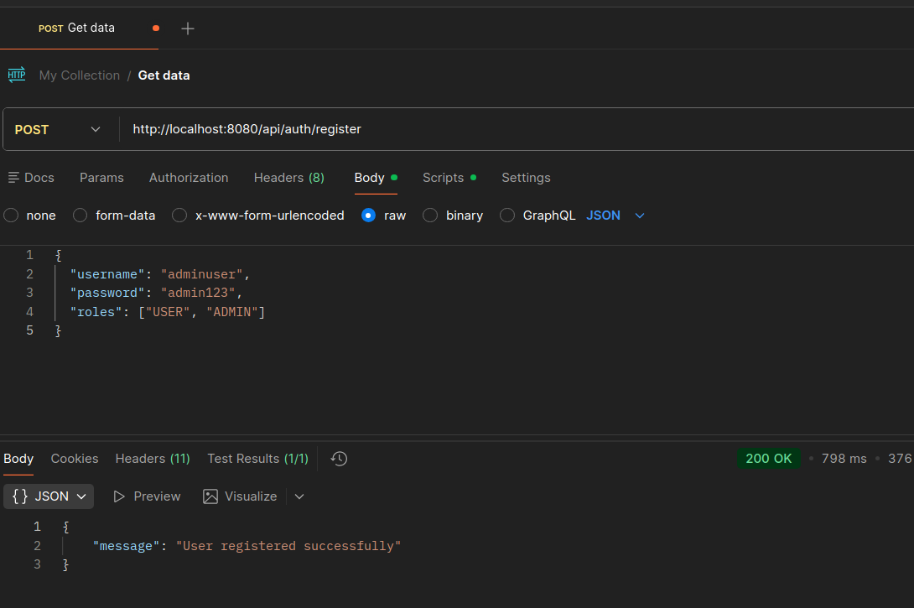
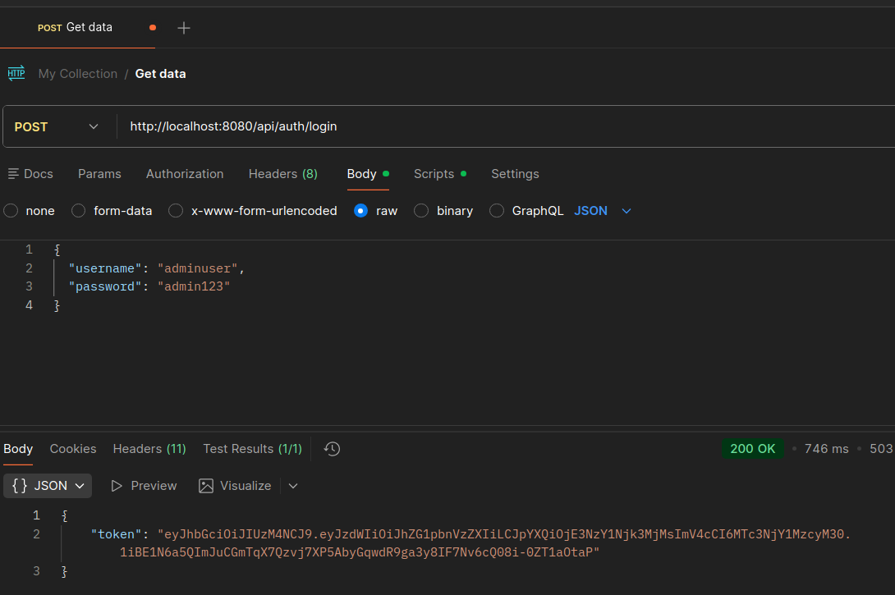
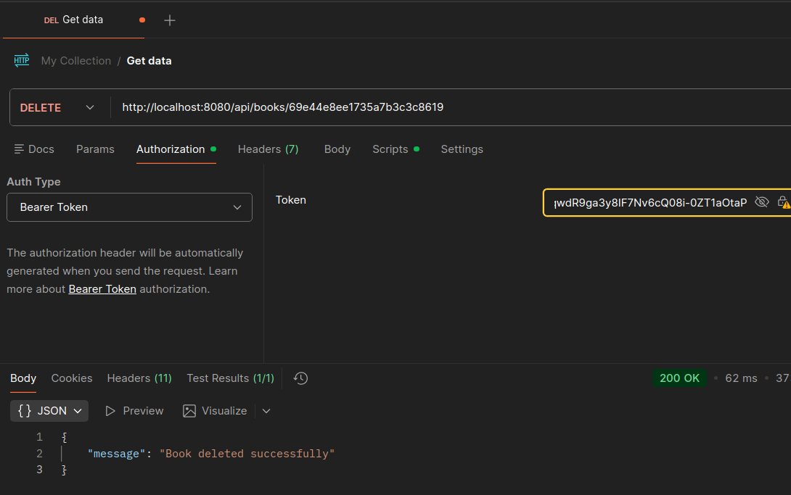
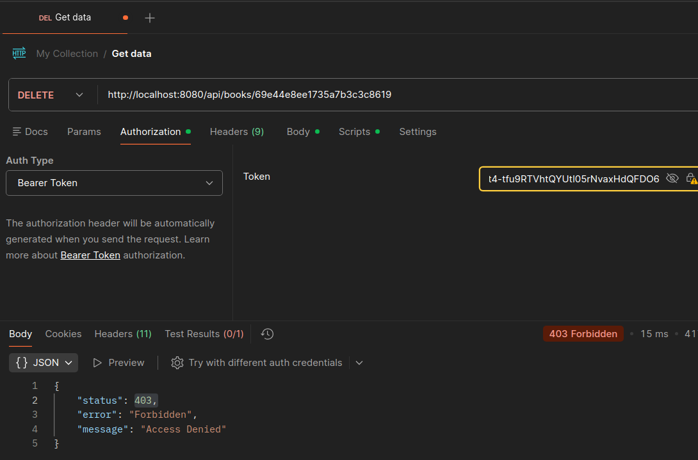

# Bookstore API - JWT Role-Based Authorization

## Assignment Goal

Implement and test a protected delete operation:

```http
DELETE /api/books/{id}
```

Only authenticated users with the `ADMIN` role are allowed to access this endpoint. Regular `USER` accounts must receive a `403 Forbidden` response.

## Implemented Requirements

- Added `DELETE /api/books/{id}` in `BookController.java`.
- Added `deleteBook(String id)` in `BookService.java`.
- Protected the DELETE endpoint in `SecurityConfig.java` with `hasRole("ADMIN")`.
- Kept `POST /api/books/**` protected with `hasRole("USER")`.
- Added JSON error responses for unauthorized and forbidden requests.
- Tested the required ADMIN and USER authorization scenarios in Postman.

## Security Rules

The current Spring Security configuration allows:

| Method | Endpoint | Access |
| --- | --- | --- |
| `POST` | `/api/auth/register` | Public |
| `POST` | `/api/auth/login` | Public |
| `GET` | `/api/books/**` | Public |
| `POST` | `/api/books/**` | `USER` role |
| `DELETE` | `/api/books/**` | `ADMIN` role |

If a logged-in user does not have the correct role, the API returns:

```json
{
  "status": 403,
  "error": "Forbidden",
  "message": "Access Denied"
}
```

## DELETE Endpoint Behavior

### Successful Delete

Request:

```http
DELETE /api/books/{id}
Authorization: Bearer <admin-jwt-token>
```

Response:

```json
{
  "message": "Book deleted successfully"
}
```

Status code: `200 OK`

### Book Not Found

Response:

```json
{
  "message": "Book with id {id} not found"
}
```

Status code: `404 Not Found`

### User Without ADMIN Role

Response:

```json
{
  "status": 403,
  "error": "Forbidden",
  "message": "Access Denied"
}
```

Status code: `403 Forbidden`

## Example Postman Requests

### Register ADMIN User

```http
POST /api/auth/register
Content-Type: application/json
```

```json
{
  "username": "admin",
  "password": "admin123",
  "roles": ["USER", "ADMIN"]
}
```

### Login as ADMIN

```http
POST /api/auth/login
Content-Type: application/json
```

```json
{
  "username": "admin",
  "password": "admin123"
}
```

Copy the `token` value from the response and use it in the `Authorization` header:

```http
Authorization: Bearer <token>
```

### Register USER Account

```http
POST /api/auth/register
Content-Type: application/json
```

```json
{
  "username": "user",
  "password": "user123",
  "roles": ["USER"]
}
```

The USER account can create books, but it cannot delete books.


## Postman Test Screenshots

### 1. Register ADMIN User - 200 OK



### 2. Login as ADMIN - JWT Token Visible



### 3. DELETE as ADMIN - 200 OK



### 4. DELETE as USER - 403 Forbidden



## Key Files Modified

- `src/main/java/com/example/bookstore_mongodb/controller/BookController.java`
- `src/main/java/com/example/bookstore_mongodb/service/BookService.java`
- `src/main/java/com/example/bookstore_mongodb/config/SecurityConfig.java`

